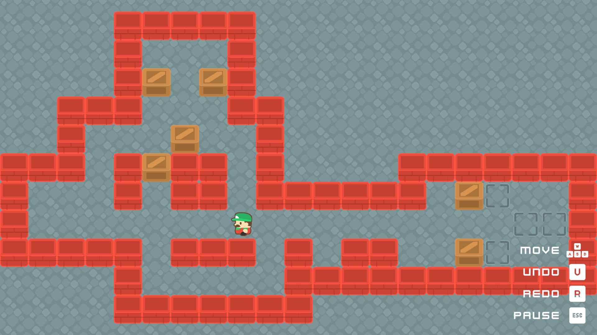
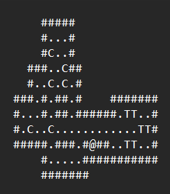

# Sokoban

A simple 2D Sokoban game created in Unity.

## Overview

This project is a classic Sokoban puzzle game where the player pushes boxes to designated target locations.

## Features

- 2D top down view.
- Grid based movement.
- Undo / Redo movement history.
- 5 challenging levels.
- Pause, Resume, and Restart level functionality.
- Resolution, Quality, and Audio settings.
- Interactive sound effects and music.
- UI menues.

## Attribution

### 2D and UI Assets:
- [Kenney](https://kenney.nl/)

### Audio:
- [Kenney](https://kenney.nl/)
- [code_box](https://freesound.org/people/code_box/sounds/651533/)
- [GWriterStudio](https://assetstore.unity.com/packages/audio/music/8bit-music-062022-225623)

## Development Notes

- Used Command design pattern for movement and undo/redo features.
- Levels are designed and loaded from text files. The keys are as follows:
  - `#`: Wall
  - `.`: Empty Space
  - `@`: Player Start Position
  - `C`: Crate
  - `T`: Target Spot (where the crates need to be moved)
  
  
- Utilized Unity's New Input System for taking input.
- The background image of the main menu was generated by DALL-E 3.
